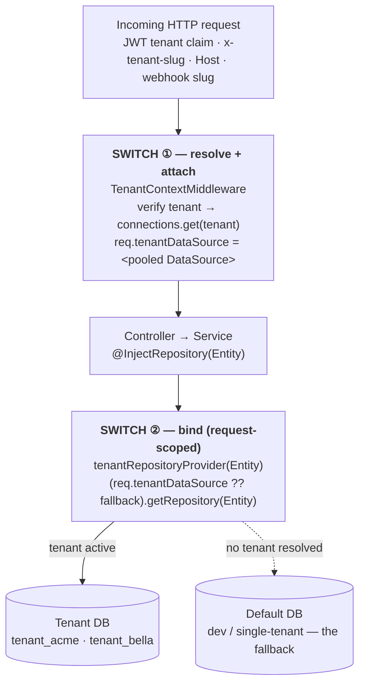
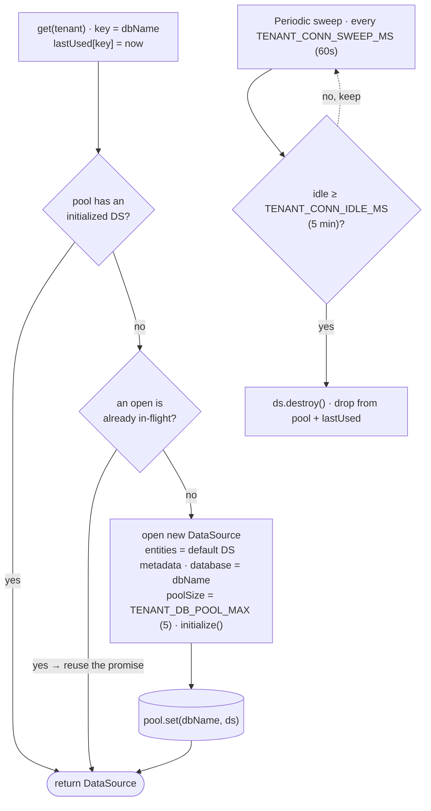

# TableTap — How the tenant database is switched

**Status:** Implemented — every request is bound to one tenant's database up front; every
`@InjectRepository` in that request then talks to it automatically.
**Model:** database-per-tenant · one pooled `DataSource` per tenant DB · request-scoped repo binding
**Related:** [tenant-setup.md](./tenant-setup.md) · [white-label-architecture.md](./white-label-architecture.md)

The switch happens in **two hops**. You only ever wire the second one (and a few edge cases below).

---

## 1. Request → tenant DB (the two switch points)



**Switch ① — `TenantContextMiddleware`** (runs before controllers / request-scoped repos).
Resolution priority:

1. **Verified JWT `tenant` claim** — authoritative. A token minted for a tenant always binds to
   that tenant's DB; a `Host` / `x-tenant-*` header cannot override it. (The signature is verified
   in the middleware with `JWT_SECRET`, then `REFRESH_JWT_SECRET`, so the claim can be trusted.)
2. **`x-tenant-slug`** header (dev / internal calls).
3. **`x-tenant-host`**, then the **`Host`** header (subdomain / custom domain).
4. **Webhook / OAuth callbacks** have no JWT, so the tenant is routed by a `<slug>.<secret>`
   embedded in the webhook URL or OAuth `state` (extracted before resolution).

If a tenant resolves and is `active`, the middleware sets
`req.tenantDataSource = await connections.get(tenant)`. Otherwise the request passes through on the
**default** connection, so single-tenant and local dev keep working.

**Switch ② — `tenantRepositoryProvider`** (request-scoped provider). It reuses the standard
`getRepositoryToken(Entity)` token, so every `@InjectRepository(Entity)` transparently resolves to:

```ts
(req.tenantDataSource ?? fallback).getRepository(Entity)
```

Services keep using `@InjectRepository` unchanged and automatically talk to the current tenant's DB.

---

## 2. Where **you** switch the DB

You never pick a DB per query. You wire it **per module**: register the repo provider for **every
entity a module reads or writes per tenant**. Miss one and that entity silently talks to the
**default** DB.

```ts
// e.g. reservation.module.ts → providers[]
tenantRepositoryProvider(Reservation),
tenantRepositoryProvider(Branch),
tenantRepositoryProvider(Table),
```

### Three cases that still need manual handling

| Case | Why | What to do |
| --- | --- | --- |
| **Singletons / non-request-scoped services** | e.g. the debounced menu-sync service can't read `req.tenantDataSource`. | Pass the tenant `DataSource` in explicitly and call `dataSource.getRepository(Entity)`. |
| **`@services/transaction.service`** (atomic `execute` / `queryRunner`) | Injects the **default** `DataSource` — it is **not** tenant-aware. | Keep tenant writes on `this.repository`, or hand the wrapper the tenant DS. |
| **No-JWT callbacks** (aggregator webhooks, OAuth returns) | No bearer token to carry the tenant claim. | Routed by the `<slug>.<secret>` in the webhook URL / OAuth `state`; the middleware extracts the slug before Switch ①. |

---

## 3. Connection pooling — `TenantConnectionService`

One `DataSource` per tenant database, created **lazily** on first use and cached. Built from the
default DataSource's registered entities, so every repository works against the tenant DB exactly as
against the default one.



Key behaviors:

- **Cache** — `pool: Map<dbName, DataSource>`. A hit on an initialized DS returns immediately.
- **In-flight de-dupe** — `pending: Map<dbName, Promise<DataSource>>`. Concurrent first-hits for the
  same tenant share **one** `initialize()` instead of opening several.
- **Idle eviction** — a sweep (`setInterval`, `.unref()`ed) destroys any pool idle beyond the TTL,
  so inactive tenants don't hold connections. `lastUsed[key]` is stamped on every `get()`.
- **Lifecycle** — `onModuleDestroy` clears the sweep timer and destroys all pools.
- **Observability** — `stats()` returns `{ open, poolMax, idleMs, connections: [{ db, idleSeconds }] }`.

### Config (env)

| Var | Default | Meaning |
| --- | --- | --- |
| `TENANT_DB_POOL_MAX` | `5` | Postgres pool size **per tenant** DataSource. |
| `TENANT_CONN_IDLE_MS` | `300000` (5 min) | Idle TTL before a tenant pool is evicted. |
| `TENANT_CONN_SWEEP_MS` | `60000` (1 min) | How often the eviction sweep runs. |

> **Scale:** `tenants × TENANT_DB_POOL_MAX` must stay within Postgres `max_connections`. For large
> tenant counts, front Postgres with **PgBouncer** and keep `poolSize` small.

---

## TL;DR

- **Switch ①** (middleware) decides *which* tenant and hangs its pooled `DataSource` on the request.
- **Switch ②** (request-scoped repo provider) binds each `@InjectRepository` to that `DataSource`, or
  to the default DB when nothing resolved.
- **Your job:** `tenantRepositoryProvider(Entity)` for every per-tenant entity in each module — plus
  the three manual cases above.
- Connections are pooled one-per-tenant-DB, opened lazily, de-duped in-flight, and evicted when idle.
